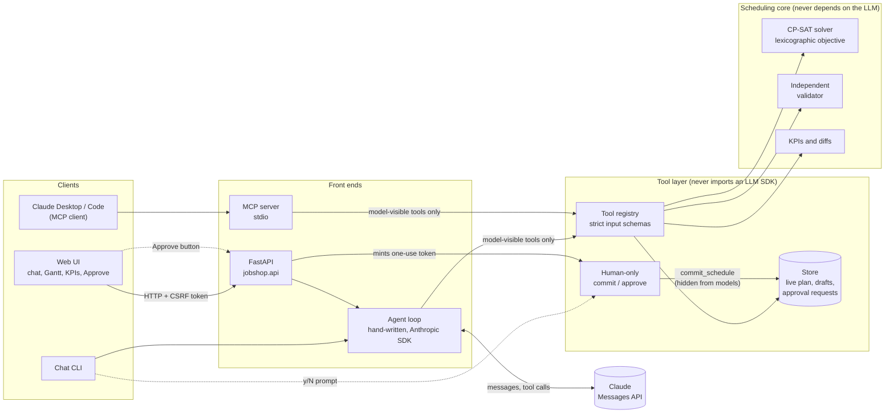

# Job-shop disruption assistant

An LLM agent that helps a production planner handle disruptions (a machine goes down, an order
turns urgent, a rush order arrives) by calling a CP-SAT scheduler as tools. The model never
touches the schedule directly and **can never commit one**: it tries changes on drafts, compares
them with the live plan, and explains the trade-offs. A person approves.

It is a portfolio project built to learn AI engineering, so the tool-use loop is hand-written on
the Anthropic SDK (no agent framework) and every safety property is tested rather than asserted.
All data is synthetic.

> **Status, honestly.** Everything below is built and tested (suite of 660+ tests, with mutation
> checks of the safety and eval code). What has **not** been done: running a real model. The author
> had no API key while building, so the agent, the evals' LLM judge and the two-model comparison have
> only run against scripted stand-ins, and the MCP server has only been driven by the MCP SDK's own
> client, not by Claude Desktop/Code. See [What is and isn't verified](#what-is-and-isnt-verified).

## Architecture



The dotted path is the only way the live plan changes, and it does not pass through the model.

**How a request flows.** The planner says "M2 is down 11:00 to 14:00". The agent creates a *draft*
(a scratch copy of the live plan), records the outage in it, and calls `reschedule` once, which
re-plans everything that has not started, keeping started work in place and moving as few
operations as it can. It compares the draft with the live plan and answers. The harness, not the
model, computes the before/after KPIs and the list of changes shown beside the answer. The planner
reviews them and presses Approve (or types `y`); only then is a single-use token minted for that exact
draft and the commit performed.

## Run it

```bash
uv sync                                  # Python 3.12, installs everything
cp .env.example .env                     # then set ANTHROPIC_API_KEY and ANTHROPIC_MODEL
uv run pytest                            # about a minute; the 2 skipped tests call a real model
```

| What | Command |
|---|---|
| **Web UI** | `uv run python -m jobshop.api` then open http://127.0.0.1:8000 |
| Chat in a terminal | `uv run python -m jobshop.agent.cli --now "2026-01-05 12:00"` |
| MCP server for Claude Desktop/Code | see [docs/MCP.md](docs/MCP.md) |
| Evals without an API key | `uv run python -m jobshop.evals run --oracle` |
| Evals on a model | `uv run python -m jobshop.evals run` |
| Compare two models | `uv run python -m jobshop.evals compare --model A --model B --judge-model C` |
| Read a trace | `uv run python -m jobshop.agent.trace_report logs/traces/<file>.jsonl` |

The web UI starts from the committed fixture shop (`evals/shop.json`: 12 orders on 4 machines, one
day) so it opens instantly. Without an API key it still shows the plan; chat is disabled. It listens on
127.0.0.1 only and refuses other addresses, because it has no login.

**The UI:** chat on the left; on the right, KPI tiles (live value, and the draft's value with a signed
delta when there is a proposal), the proposal with the system-recorded changes and solver status, an
Approve/Reject pair, and a Gantt chart of the live plan and, below it, of the draft. In the draft chart,
orange operations moved or are new; a red diamond marks the last operation of a late order; shaded
blocks are outages. Hover or tab to a bar for details; every chart has a table view. Colors are a
validated colorblind-safe palette; there is a dark mode.

## Design decisions (and why)

**Scheduling**
- *Flexible job shop in CP-SAT*, integer minutes, non-preemptive operations (each fits inside one
  availability window and never overlaps an outage). Priority 5 is most urgent; weights 1/2/4/8/16.
- *Strict lexicographic objective:* weighted tardiness first, then (against the live plan) fewest
  operations moved, then makespan. Stages 1 and 2 are one solve with objective `(K+1)·tardiness + moved`,
  which is exactly that order; stage 3 re-solves with both optima held. The consequence is stated, not
  hidden: one minute of tardiness outweighs any number of moves.
- *Never say "optimal" unless proven.* Results carry the solver status and which parts were proven; at
  the default full size (81 operations, 30 s) nothing is proven optimal, and the agent is told to say so.
- *An independent validator* (it imports neither the solver nor its interval helpers and does not trust
  the solver's own numbers) checks every schedule before a model sees it and again before a commit.

**The agent**
- *Hand-written tool-use loop*, with the client injected so tests drive it with a scripted fake that
  returns real SDK message objects. It stops on step, token and cost limits and never leaves history invalid.
- *Edit tools only touch a draft; `reschedule` is the only tool that solves.* A draft remembers the plan
  version it came from and is refused everywhere once that moves on.
- *The model supplies words, not facts.* The final answer's KPIs, change list and "needs approval" come
  from the store. Tool results are display-ready strings and whole numbers so there is nothing to re-round.
- *The model is told never to compute a number*, and the eval checks that every number in an answer appeared
  in something the model was shown.

**Safety** ([docs/SAFETY.md](docs/SAFETY.md))
- *The model has no commit tool.* Commit needs a signed, single-use, expiring token bound to the draft,
  the plan version and a digest of the draft's schedule **and its edits**; only code a person drives can
  mint one. (The digest used to cover only the schedule: building the web UI exposed that an edit which moved
  nothing could ride on an earlier approval. Fixed, with regression tests, in the shared path.)
- *Free text is data.* Order notes reach the model on one line, size-capped, in a field named
  `notes_untrusted_text`; hostile-note scenarios are in the evals and the unit tests show what even a
  fully obedient model could do (edit a draft that a human then sees as it really is).
- *Strict inputs, capped blast radius, terminal and HTML hygiene.* Times are exactly `YYYY-MM-DD HH:MM`,
  ids match the shape the system generates, drafts/edits/pending requests are capped, and neither CLI nor UI
  can be made to redraw or script itself from model text.
- *The Approve endpoint is guarded like a transfer form:* per-run CSRF token, Origin and Host checks, a strict
  Content-Security-Policy, loopback-only, and the page sends the fingerprint of what it displayed so a changed
  draft cannot be approved.

**Evals and observability** ([docs/EVALS.md](docs/EVALS.md), [docs/OBSERVABILITY.md](docs/OBSERVABILITY.md))
- 29 scenarios in YAML; five checks that read the store and tool log, not prose; an LLM judge that must be a
  different model and treats the graded answer as untrusted; a scripted reference agent and deliberately
  bad agents prove the checks can fail; the eval code itself was mutation-tested.
- Traces are versioned JSONL with per-step tokens, latency and cost (null, never 0, without prices) and a
  split between model time and solver time. Model comparison reports confidence intervals and a paired test
  instead of declaring a winner on 29 scenarios.

## Eval results

**No real model has been evaluated yet.** What exists:

| Run | Result | What it means |
|---|---|---|
| Scripted reference agent on all 29 scenarios | 29/29 | The scenarios are satisfiable and the harness works. It says **nothing** about any model. |
| Deliberately bad agents (one per check) | each fails exactly the check aimed at it | The checks are not rubber stamps. |
| `compare --demo` (two scripted agents) | report format only | Shows quality / cost / latency side by side; the numbers are made up. |

To produce real results, with your own models and their real prices:

```bash
uv run python -m jobshop.evals compare \
    --model <A> --price <A>=IN,OUT --model <B> --price <B>=IN,OUT --judge-model <C> --repeat 3
```

and paste the table from `evals/results/<run>/comparison.md` here.

## What is and isn't verified

| Verified | Not verified |
|---|---|
| The solver (feasibility, objective order, stability) against an independent validator and recomputation | Any real model call: agent behaviour, the judge, the live prompt-injection test (`JOBSHOP_RUN_LIVE=1`, opt-in) |
| Tool, loop, approval, store and MCP behaviour, including the MCP server over real stdio | Claude Desktop/Code connecting to the MCP server (timeouts, how they present instructions) |
| The web API, including CSRF/Origin/Host/CSP and the approval digest, over a real socket | The web UI against a real model (it was driven end to end with a scripted stand-in) |
| The UI in a real browser: chat, proposal, Approve, charts, dark mode, phone width, HTML in answers stays inert text | Screen readers; browsers other than the one in the author's app |
| Safety, eval and API code by mutation testing (every guard broken on purpose, a test fails for each) | A security audit: this is a local single-user app, not hardened for a network |

## Known limits

- At the default size nothing is proven optimal in 30 s, and strict priority means a tiny tardiness gain can
  justify moving many operations. A tardiness-versus-disruption tolerance is an open decision, not implemented.
- One planner, one shop, state in memory (the web app) or a JSON file (MCP): no accounts, no history, no
  multi-user. Restarting the web app resets drafts.
- 29 eval scenarios on one small synthetic shop catch regressions; they cannot rank models that are close.
- Setup times, workers/labour, preemption and buffers are out of scope.

## Layout

```
src/jobshop/core/        models, solver, validator, KPIs, change and reschedule rules   (no LLM)
src/jobshop/tools/       store, approval tokens, tool functions, registry, human-only commit  (no LLM)
src/jobshop/agent/       hand-written loop, prompts, conversation, traces, chat CLI
src/jobshop/mcp_server/  stdio MCP server and the human `admin` command
src/jobshop/api/         FastAPI app and the web UI (static/)
src/jobshop/evals/       scenarios, checks, judge, runner, comparison, reference agent
evals/                   fixture shop, 29 scenarios (YAML), results (gitignored)
tests/                   mirrors src/; fake_llm.py is a scripted stand-in returning real SDK messages
docs/                    MCP.md, SAFETY.md, EVALS.md, OBSERVABILITY.md
```

Built in phases, each reviewed before the next: proposal, core, tools and agent, MCP server, safety,
evals, observability, API and UI. `CLAUDE.md` records the decisions and working rules.
