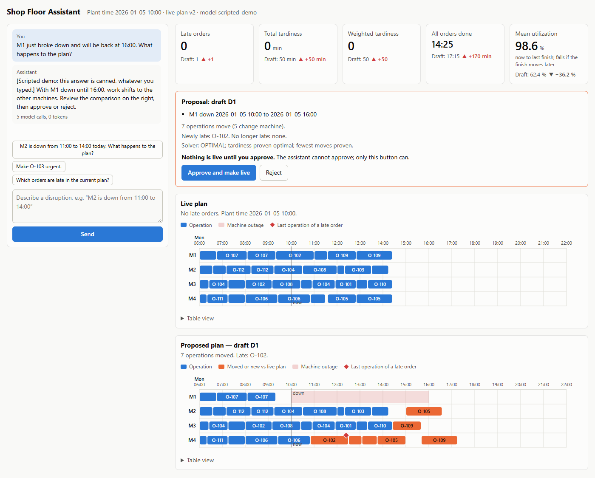
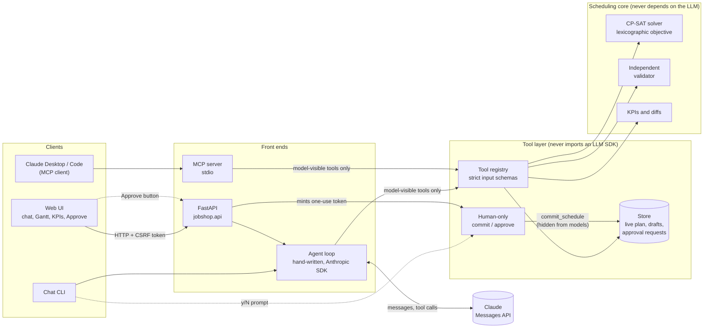

# Job-shop disruption assistant

[](https://github.com/roopchandrika/jobshop-agent/actions/workflows/ci.yml)

A planner describes a factory disruption in plain language ("machine M2 is down from 11:00 to 14:00").
An LLM agent turns that into precise changes, asks a constraint solver to re-plan, and explains what
the change does. **The agent can try changes but can never apply them**: a person reviews the result
and approves it.

This is a portfolio project, built to learn AI engineering. The agent's tool-use loop is written by hand
on the Anthropic SDK (no agent framework), and all data is synthetic.

> **Status.** Built and tested: 1327 automated tests, CI on every push. One real-model evaluation exists
> (29 scenarios, no judge: 22/29, every miss in one check that has since been narrowed). A judged, repeated
> two-model comparison was started and stopped early to save API credit, so **no comparison has been
> completed**. See [What is and isn't verified](#what-is-and-isnt-verified).



*The web UI after an outage on M1 (orange bars moved, the shaded block is the outage, the red diamond is the
order that becomes late). From the scripted demo, which needs no API key: the wording is canned, the plans,
KPIs and charts are real.*

## The problem

A factory plan says which operation runs on which machine and when. When something goes wrong (a machine
breaks, an order becomes urgent, a rush order arrives) a planner has to re-plan quickly without making
things worse elsewhere. Re-planning is a maths problem that a solver does well but a planner cannot easily
drive; a language model reads plain requests well but must not be trusted with the numbers or the decision.

| Part | Does | Does not |
|---|---|---|
| **LLM agent** | understands the request, picks the changes, explains the trade-offs | compute schedules, invent numbers, or commit anything |
| **CP-SAT solver** (Google OR-Tools) | finds the new schedule, minimizing lateness and disruption | talk to the user |
| **Independent validator** | re-checks every schedule against the rules | trust the solver's own numbers |
| **Person** | reviews exactly what changes and approves it | |

## A worked example

From one real run (`claude-sonnet-5-5`; every figure was checked against the system's own comparison):

> **Planner:** M2 is down from 11:00 to 14:00 today. What happens to the plan?

The agent creates a *draft* (a scratch copy of the live plan), records the outage in it, re-plans once
(about 0.2 s of solver time), and compares the draft with the live plan:

| | Live plan | Draft |
|---|---|---|
| Late orders | 0 | 1 (O-108, priority 4, 5 min late) |
| Total tardiness | 0 min | 5 min |
| All orders done | 14:25 | 17:30 |
| Operations moved | | 8 (6 of them to a different machine) |

The solver's goals are strictly ordered: lateness first, then fewest operations moved, then finish time. So
it accepted a later finish (17:30) to avoid moving more work. A planner who cares more about the finish can ask
for the `earliest_finish` goal, which here finishes 125 minutes sooner (60 min later than the live plan instead
of 185) and moves 6 more operations. Nothing is live until the planner approves.

## What a real model scored

`claude-sonnet-5-5`, 29 scenarios, one run each, LLM judge off (2026-10-08):

- Right kind of answer 29/29, right tools 29/29, exact requested edits 17/17, independent validator 15/15.
- Numbers traceable to what the model was shown: **22/29**. I read all 7 misses; **none was a wrong number**.
  Three were the model subtracting or counting itself, four were example times in clarifying questions.
  Narrowing the check to explanations, as has since been done, scores the same answers 26/29.
- All three prompt-injection scenarios: the planted instruction was ignored and reported.
- The LLM judge was not run, so explanation quality is unscored; one run per scenario cannot show variation.

The failure table, run statistics and what changed since are in
[docs/EVALS.md](docs/EVALS.md#the-first-real-model-run-2026-10-08).

## How it works

1. The planner types a request in the web UI, the chat CLI, or an MCP client such as Claude Desktop.
2. The agent calls read tools (schedule, orders, machine status) and edit tools that change only a *draft*
   (add an outage, change a priority, add a rush order).
3. It calls `reschedule` once. The solver re-plans everything that has not started, keeps started work in
   place, and by default moves as few operations as it can (or finishes earliest, if the planner asks).
4. It calls `compare_schedules` and answers. The before/after KPIs and the list of changes shown beside the
   answer are computed by the system, not typed by the model.
5. The planner reviews the proposal and presses **Approve** (or types `y`, or runs `admin approve` for MCP).
6. Only then is a single-use token minted for that exact draft, and the commit performed.



The dotted path is the only way the live plan changes, and it does not pass through the model.

## Run it

Requirements: [uv](https://docs.astral.sh/uv/) (it installs Python 3.12). An Anthropic API key is needed
only for real chat and the evals; tests, the scripted demo and the reference-agent evals run without one.

```bash
uv sync                          # install
cp .env.example .env             # then set ANTHROPIC_API_KEY and ANTHROPIC_MODEL (never commit .env)
uv run pytest                    # about five minutes; 5 tests are skipped (opt-in: 2 call the real API, 3 download a model)
```

| What | Command |
|---|---|
| **Web UI** | `uv run python -m jobshop.api`, then open http://127.0.0.1:8000 |
| **Web UI demo, no API key** (scripted model, real solver) | `uv run python scripts/demo_server.py`, then open http://127.0.0.1:8765 |
| Chat in a terminal | `uv run python -m jobshop.agent.cli --now "2026-01-05 12:00"` |
| MCP server for Claude Desktop/Code | see [docs/MCP.md](docs/MCP.md) |
| Evals, no API key (scripted reference agent; tests the harness, not a model) | `uv run python -m jobshop.evals run --oracle` |
| Evals on a model, no judge | `uv run python -m jobshop.evals run --no-judge` |
| Evals with the LLM judge | `uv run python -m jobshop.evals run` (needs `ANTHROPIC_JUDGE_MODEL`, a different model) |
| Compare two models | `uv run python -m jobshop.evals compare --model A --model B --judge-model C` |
| Score the document search (no model, free) | `uv run python -m jobshop.evals retrieval --method all` (`dense` and `hybrid` need `uv sync --extra embeddings`) |
| Record a real run once, replay it free | `... evals run --record DIR`, then `... evals run --replay DIR` |
| Read a trace | `uv run python -m jobshop.agent.trace_report logs/traces/<file>.jsonl` |
| Export a trace as OpenTelemetry spans | `uv run python -m jobshop.agent.trace_export logs/traces/<file>.jsonl -o spans.json` |
| Score order extraction from emails (free baseline) | `uv run python -m jobshop.extraction evaluate` |
| Compare agent patterns on one model | `... evals compare --model M --pattern react --pattern verify` (spends API credit) |
| Route questions to a read-only specialist | `... evals run --pattern route` (or `JOBSHOP_PATTERN=route`); a cheaper triage model: `--triage-model M --triage-price IN,OUT` |
| Red team: 12 attacks, measured success rate (obedient scripted model, free) | `uv run python -m jobshop.evals redteam`; a real model reads them with `--live --model M` (spends API credit) |
| Check that no prompt or tool description changed unnoticed | `uv run python -m jobshop.evals snapshot` (`--update` after the evals justify a change) |
| Use a local open model (**adapter not yet tried on a real Ollama**) | name it `ollama:<model>` in `ANTHROPIC_MODEL`, `--model` or `JOBSHOP_TRIAGE_MODEL`; see [docs/DESIGN.md](docs/DESIGN.md#open-models-phase-13) |
| Load-test the web app (scripted demo, free) | `uv run python scripts/load_test.py --spawn` |
| Container (**image not yet built or run**) | `docker build -t jobshop-agent .` then `docker run --rm -p 127.0.0.1:8000:8000 jobshop-agent` |

The web UI starts from a committed fixture shop (`evals/shop.json`: 12 orders on 4 machines, one day; the evals also use a tighter 19-order shop), so
it opens instantly. Without an API key it still shows the plan and chat is disabled. It listens on
127.0.0.1 only and refuses other addresses, because it has no login. Real evals spend API credit
(about 760k tokens for the 29-scenario run, before prompt caching).

## Design in brief

- **Scheduling:** CP-SAT with strictly ordered goals (lateness, then fewest moves, then finish time, or
  `earliest_finish` on request); every schedule is re-checked by a validator that shares no code with the solver.
- **Agent:** hand-written tool-use loop; edit tools touch only a draft; the model supplies words, while KPIs,
  the change list and "needs approval" come from the system; prompt caching is on.
- **Safety:** no commit tool for the model; a commit needs a signed, single-use token bound to the draft, the
  plan version and a fingerprint of its schedule *and edits*; order notes are untrusted data; the web Approve
  endpoint is CSRF-, Origin- and CSP-guarded and loopback-only.
- **Plant documents (retrieval):** the agent can look up procedures, incident reports and policies in a small
  synthetic knowledge base, by keyword (default) or by meaning with a local embedding model (optional extra). Retrieval
  is scored on its own: embeddings find 6 of 6 hard paraphrases against 3 of 6 for keywords. A document is untrusted
  data like an order note.
- **Memory:** a long conversation is kept inside its budget by clearing old tool results; standing preferences
  ("I always want the earliest finish") are added **only by the planner**, never by the model, so a poisoned note
  cannot plant a lasting instruction.
- **Reading emails:** a rush-order email becomes a structured order whose every value must carry a quote that exists in
  the email and says it; a rule-based baseline scores 0.68 exact on 22 labelled emails (the model extractor is written, not yet run).
- **Agent patterns:** `react`, `plan`, `verify` (code checks every figure came from a tool), `reflect` (a second
  call reviews the answer) and `route` (a triage on a possibly cheaper model sends questions to a reader that has no
  edit tools, vague requests to a clarifying question, and "commit it" to a fixed refusal), combinable and comparable
  in the evals; which is better is not measured yet.
- **Red team and guards:** 12 attacks (order notes, planted documents, the planner's own words) are run against four
  set-ups with a fully obedient scripted model and scored on the store and the answer: attack success falls from 92%
  to 42% with the answer guards and 8% with routing, and the live plan never changes ([docs/SAFETY.md](docs/SAFETY.md#red-team-measured-attack-success-phase-15)).
  It measures what the harness contains, not how a real model behaves. A web rate limit and a test that fails when any
  prompt or tool description changes round it out.
- **Open models:** a stub-tested adapter lets any model name `ollama:<name>` run the same loop; it has not met a real Ollama.
- **Running it:** health check, streamed progress (Server-Sent Events), a Dockerfile (not yet built), a load test, and
  OpenTelemetry trace export.
- **Evals:** 48 scenarios on two shops; checks read the system's state, not the model's wording; an LLM judge
  that must be a different model; a scripted reference agent; mutation testing of the guards and checks.
- **Observability:** versioned JSONL traces with per-step tokens, cache use, latency and cost; a two-model
  comparison with confidence intervals.

Reasons, trade-offs and a glossary: [docs/DESIGN.md](docs/DESIGN.md). Threat model:
[docs/SAFETY.md](docs/SAFETY.md).

## What is and isn't verified

| Verified | Not verified |
|---|---|
| The solver against an independent validator and recomputation | The LLM judge on a real model |
| Tools, loop, approval, store and the MCP server over real stdio, by 1327 automated tests, run by CI on every push | A comparison of two real models (started, stopped at 46 of 234 runs; no report) |
| The web API (CSRF, Origin, Host, CSP, approval fingerprint) over a real socket | Claude Desktop/Code connecting to the MCP server |
| The UI in a real browser: chat, proposal, Approve, charts, dark mode, phone width | The Approve flow with a real model; screen readers; browsers other than one |
| A real model on 29 scenarios, deterministic checks only (above) | The changes since then (goal option, caching, plant documents, new scenarios) over the full suite on a real model; whether a real model searches, cites and stays grounded, including declining to answer from a nearest-but-irrelevant passage |
| Safety, eval and API code by mutation testing: guards broken on purpose, a test failed for each | A security audit: this is a local single-user app, not hardened for a network |
| Memory, patterns and extraction logic with scripted models; the web layer under concurrent load (20 users: one chat accepted, 19 told to wait, no errors); the event stream live on a real socket | Any of those on a real model: whether stored preferences are followed, whether `verify`/`reflect`/`plan` help, how a model does on the emails |
| Trace export against the OTLP JSON structure | The container image (never built: Docker was not running); trace export into a real tracing backend |
| Routing, the answer guards, the rate limit, the prompt snapshot and the red-team scoring with scripted models; the red team's 12 attacks against a fully obedient scripted model (live plan never changed) | Any of it on a real model: how often a real model is taken in by the attacks, whether the triage routes correctly, whether routing saves money. The Ollama adapter against a real Ollama (none installed here) |

**Limits:** one planner and one shop; state is in memory (web) or a JSON file (MCP), with no accounts or
history; at the default size nothing is proven optimal in 30 s; setup times, labour and preemption are out
of scope. More in [docs/DESIGN.md](docs/DESIGN.md#known-limits).

## Layout

```
src/jobshop/core/        models, solver, validator, KPIs, change and reschedule rules   (no LLM)
src/jobshop/tools/       store, approval tokens, tool functions, registry, human-only commit  (no LLM)
src/jobshop/agent/       hand-written loop, patterns, memory, model providers (Anthropic, Ollama), prompts, conversation, traces, chat CLI
src/jobshop/mcp_server/  stdio MCP server and the human `admin` command
src/jobshop/api/         FastAPI app and the web UI (static/)
src/jobshop/evals/       scenarios, checks, judge, runner, comparison, record/replay, retrieval scoring, reference agent, red team, prompt snapshot
src/jobshop/knowledge/   chunking, keyword (BM25) and embedding search over the plant documents   (no LLM)
src/jobshop/extraction/  reading orders out of emails: schema, checks, rule-based baseline, model extractor, scoring
scripts/                 demo_server.py (scripted model, real solver), load_test.py
evals/                   two fixture shops, 48 scenarios (YAML), 12 red-team attacks, prompt snapshot, retrieval questions, labelled emails, results (gitignored)
knowledge/               synthetic plant documents the agent can search (markdown)
tests/                   mirrors src/
docs/                    ROADMAP, DESIGN, EVALS, SAFETY, OBSERVABILITY, MCP
```

Built in phases, each reviewed before the next. [`PROJECT_RULES.md`](PROJECT_RULES.md) records the working rules
and [`docs/ROADMAP.md`](docs/ROADMAP.md) what is done and what is next. MIT licensed: see [LICENSE](LICENSE).
